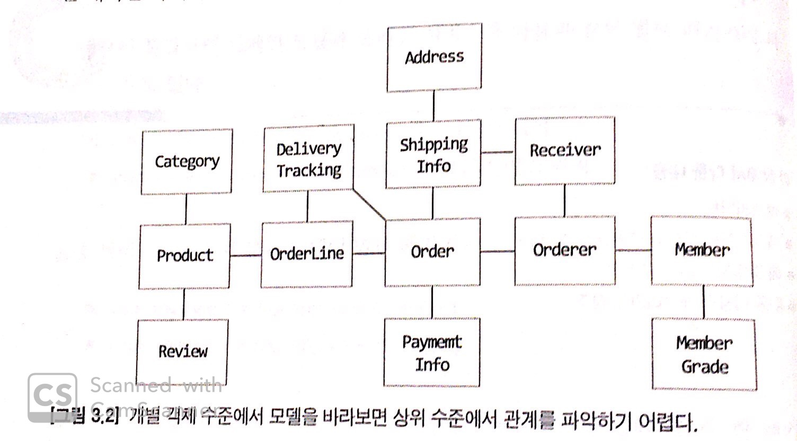
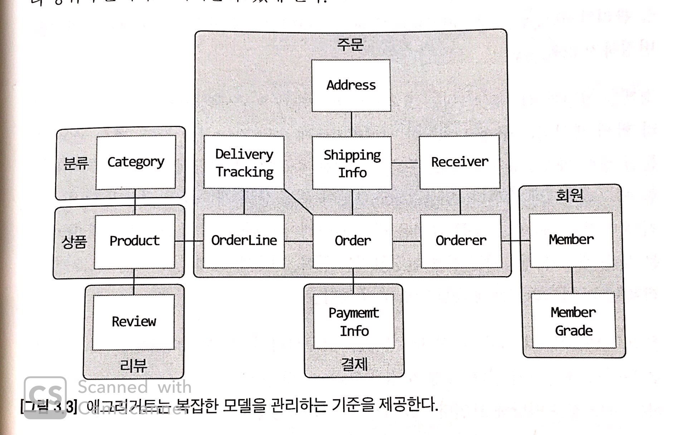
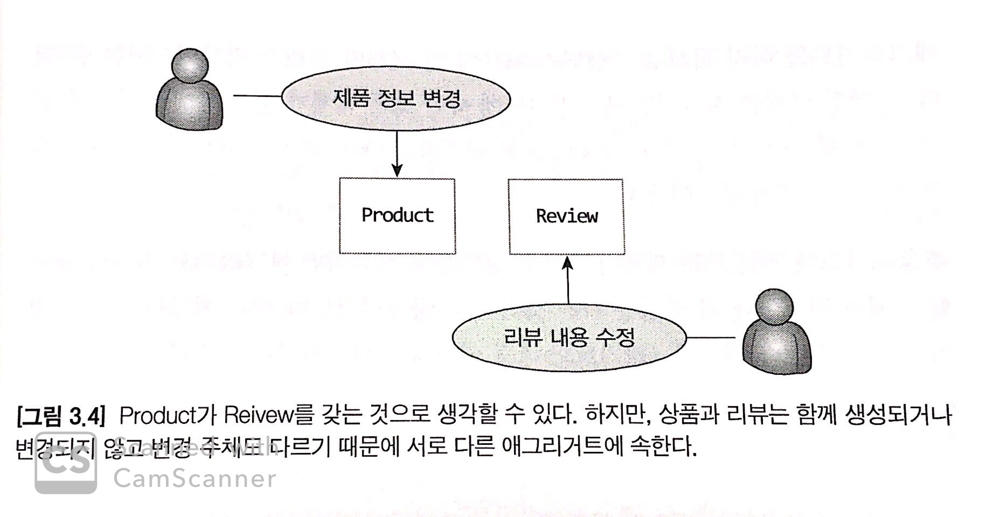

# 3. 애그리거트

## 들어가기 앞서

* 상위 수준에서 모델을 정리하면 복잡한 도메인 모델의 관계를 이해하는데 도움이 된다.
* **복잡한 도메인을 이해하고 관리하기 쉬운 단위로 만들어 상위 수준에서 모델을 조망할 수 있는                                  방법이 애그리거트이다.**

## 애그리거트

* 애그러거트는 관련된 객체를 하나의 군으로 묶어준다.
* 수 많은 객체를 애그리거트로 묶어서 바라보면 좀 더 상위 수준에서 도메인 모델 간의 관계를 파악할 수있다.
* 73p 그림3.3을 보면 복잡했던 그림3.2를 애그리거트로 묶음으로 인하여 모델 간의 관계를 개별 모델 수준과 함께 상위 수준에서도 이해할 수 있게 된다.

  

* 애그리거트는 모델을 이해하는데 도움을 줄 뿐만 아니라 일관성을 관리하는 기준이 된다.
* 애그리거트의 객체들은 유사하거나 동일한 라이프사이클을 가지게 된다.
  * 따라서 애그리거트에 속한 구성요소는 대부분 함께 생성하고 함께 제거한다.
  * 한 애그리거트에 속한 객체는 다른 애그리거트에 속하지 않는다.
* 애그리거트는 독립된 객체군이며, 각 애그리거트는 자기 자신을 관리할 뿐 다른 애그리거트를 관리하지 않는다.
* 경계를 설정할 때 기본이 되는 것은 도메인 규칙과 요구사항이다.

  * 도메인 규칙에 따라 함께 생성되는 구성요소는 한 애그리거트에 속할 가능성이 높다.
  * 함께 변경되는 빈도가 높은 객체는 한 애그리거트에 속할 가능성이 높다.
  * 예외사항 - 75p 그림3.4와 같이 삼품과 리뷰가 같이 표출되어야 한다는 요구사항이 존재 할 경우 상품과 리뷰는 같은 애그리거트로 이해 할 수 있지만, 상품과 리뷰는 함께 생성되지 않을 뿐더라 변경 주체도 다르기 때문에 서로 다른 애그리거트에 속한다.
  * 따라서 예상보다 하나의 엔티티 객체를 갖는 애그리거트가 많으며, 두 개 이상의 엔티티로 구성 되는 애그리거트는 예상보다 많지 않다.

  

 

## 애그리거트 루트

* 애그리거트는 여러 객체로 구성되기 때문에 한 객체만 상태가 정상이서는 안 된다. 도메인 규칙을 지키려면 애그리거트에 속한 모든 객체가 정상 상태를 가져야 한다.
* 애그리거트에 속한 모든 객체가 일관된 상태를 유지하려면 애그리거트 전체를 관리할 주체가 필요한데 이 책임을 지는 것이 **애그리거트의 루트 엔티티**이다.
* 애그리거트의 루트 엔티티는 대표로써 애그리거트의 속한 객체는 루트 엔티티에 직접 또는 간접적으로 속한다.

### 도메인 규칙과 일관성

* 애그리거트 루트는 애거리거트에 속한 객체를 포함하는 것으로 끝나는 것이 아닌 애그리거트 루트의 핵심 역활은 애그리거트의 일관성이 깨지지 않도록 하는 것이다.
* 예를들어 주문 애그리거트는 배송지 변경, 상품변경과 같은 기능을 제공하는데 루트인 주문 애그리거트가 이 기능을 구현 한 메서드를 제공한다.

  ```java
  /**
  - 주문 루트 애그리거
  **/
  public class Order {
      // 애그리거트 루트는 도메인 규칙을 규현한 기능을 제공한다.
      public void changeShippingInfo(ShippingInfo newShippingInfo) {
          ...
      }
    
      ...
  }
  ```

* 아래는 애그리거트 루트인 Order에서 ShippingInfo를 가져와 직접 정보를 변경하고 있다. 

  ```java
  // 애그리거트 루트에서가 아닌 직접 변경하고 있다.
  Shippinginfo si = order.getShippingInfo();
  si.setAddress(newAddress);
  ```

* 애그리거트 루트가 아닌 다른 객체가 애그리거트에 속한 객체를 직접 변경하면 안된다. 
  * 데이터의 일관성이 깨지고 일관성을 지키기위해 응용 서비스에 벨리데이션 체크를 할 수 있지만 동일한 로직이 여러 응용서비스에 중복해서 구현 될 가능성이 크다.78p상단 소스 참고
* 불필요한 중복을 피하고 애그리거트 루트를 통해서만 도메인 로직을 구현하게 만들려면 아래 두가지를 습관적으로 적용해야한다.
  * 단순히 필드를 변경하는 set 메서드를 공개 범위로 만들지 않는다.
  * 벨류 타입은 불변으로 구현한다.
    * 벨류 타입을 불변으로 만들어 상태를 변경할 수 없게하면 위와 같이 직접 변경할 경우 컴파일 에러가 난다.
    * 불변인 벨류타입을 변경하려면 새로운 벨류 객체를 전달하여 변경한다.

### 애그리거트 루트의기능 구현

* 애그리거트 루트는 애그리거트 내부의 다른 객체를 조합해서 기능을 완성한다.
* 예를들어 Order는 총 주문 금액을 구하기 위해 OrderLine 목록을 사용한다.

  ```java
  public class Order {
      private Money totalAmount;
      private List<OrderLine> orderLines;
    
      private void calculateTodalAmounts() {
          int sum = orderLines.stream()
                    .mapToInt(ol -> ol.getPrice() * ol.quantity())
                    .sum();
          this.totalAmounts = new Money(sum);
      }
  }
  ```

### 트랜잭션 범위

* 트랜잭션의 범위는 작을수록 좋다.
* 한 트랜잭션에서는 한개의 애그리거트만 수정해야한다.
  * 한 트랜잭션에서 두 개 이상의 애그리거트를 수정하면 트랜잭션 충돌이 발생할 가능성이 더 높아진다.
  * 한 트랜잭션에서 한 애그리거트만 수정한다는 것은 애그리거트에서 다른 애그리거트를 변경하지 않는 다는것을 뜻한다.
* 한 애그리거트가 다른 애그리거트의 기능에 의존하면 애그리거트 간 결함도가 높아져 향후 수정 비용이 증가하기 때문에 애그리거트에서 다른 애그리거트의 상태를 변경하지 말아야한다,
  * 부득이하게 한 트랜잭션으로 두 개 이상의 애그리거트를 수정해야 한다면 애그리거트에서 다른 애그리거트를 수정하지 말고 응용 서비스에서 두 애그리거트를 수정한다.
* 한 트랜잭션에서 한 개의 애그리거트를 변경하는 것을 권장하지만 다음의 경우에는 두 개 이상의 애그리거트를 변경하는 것을 고려할 수 있다.
  1. 팀표준 - 팀이나 조직의 표준에 따라 관련된 응용 서비스의 기능을 한 트랜잭션으로 반드시 사용해야 하는 경우
  2. 기술 제약 - 한 트랜잭션에서 두 개 이상의 애그리거트를 수정하는 대신 도메인 이벤트와 비동기를 사용하는 방식을 사용하는데 기술적으로 그렇게 하지 못 할 경우
  3. UI 구현의 편리 - 운영자의 편리함을 위하여 주문 목록 화면에서 여러 주문 상태를 한번에 변경하고 싶을 경우 한 트랜잭션에서 여러 주문 애그리거트 상태를 변 

## 애그리거트와 리포지터리

* 애그리거트는 개념상 완전한 한 개의 도메인 모델을 표현하므로 객체의 영속성을 처리하는 리포지터리는 애그리거트 단위로 존재한다.
* 예를들어 Order가 애그리거트 루트이고 OrderLine인 애그리거트에 속하는 구성요소로 Order를 위한 리포지터리만 존재한다.
* 애거리거트를 영속화하고 애그리거트를 사용하려면 저장소에서 애그리거트를 읽어야 하므로 리포지터리는 적어도 다음의 두 메서드를 제공해야한다.
  * save - 애그리거트 저장
  * findById - ID로 애그리거트를 구함
* 애그리거트는 개념적으로 하나이므로 리포지터리는 애그리거트 전체를 저장소에 영속화 해야한다.

  ```java
  // 리포지터리에 애그리거트를 저장하면 애그리거트 전체를 영속화해야 한다.
  orderRepository.save(order);

  // 리포지터리는 완전한 order를 제공해야 한다.
  Order order = orderRepository.findById(orderId);
  ```

* 리포지터리가 완전한 애그리거트를 제공하지 않으면 필드나 값이 올바르지 않아 애그리거트의 기능을 실행하는 도중에 NullPointerException과 같은 이슈가 발생한다.
* RDMS를 이용해서 리포지터리를 구현하면 트랜잭션을 이용하여 애그리거트의 변경이 저장소에 반영하는 것을 보장할수 있고 NoSQL를 사용할 경우 애그리거트를 한 개 문서에 저장함으로써 보장 할 수 있다.

## ID를 이용한 애그리거트 참조

## 애그리거트 간 집합 연관

## 애그리거트를 팩토리로 사용하기

